<!--
#######################################################################

Tractus-X - Special Interest Group (SIG) Architecture

Copyright (c) 2025 Bayerische Motoren Werke AG, CGI Deutschland B.V. & Co. KG, Cofinity-X GmbH, DENSO Europe, Metaform Systems Inc., SAP Deutschland SE & Co. KG

See the NOTICE file(s) distributed with this work for additional
information regarding copyright ownership.

This work is made available under the terms of the
Creative Commons Attribution 4.0 International (CC-BY-4.0) license,
which is available at
https://creativecommons.org/licenses/by/4.0/legalcode.

SPDX-License-Identifier: CC-BY-4.0

Source URL: https://github.com/eclipse-tractusx/sig-architecture

#######################################################################
-->

# Multiple wallet providers and Bring Your Own Wallet for the Catena-X dataspace

This white paper has been created by the Catena-X SSI Expert Group.

<!-- TOC -->
* [Introduction](#introduction)
* [Past wallet solutions in Catena-X](#past-wallet-solutions-in-catena-x)
  * [Pre-Jupiter: Centralised multi-tenant wallet](#pre-jupiter-centralised-multi-tenant-wallet)
  * [Jupiter: Centralised use of a decentralised wallet](#jupiter-centralised-use-of-a-decentralised-wallet)
* [Solutions for the Catena-X target wallet architecture](#solutions-for-the-catena-x-target-wallet-architecture)
  * [Solution 1: Wallets as a white-label service](#solution-1-wallets-as-a-white-label-service)
  * [Solution 2: Bring Your Own Wallet (BYOW)](#solution-2-bring-your-own-wallet-byow)
  * [Solution 3: Choose wallet provider from marketplace](#solution-3-choose-wallet-provider-from-marketplace)
* [Wallet Assumptions](#wallet-assumptions)
* [Credential Issuer Assumptions](#credential-issuer-assumptions)
* [Processes](#processes)
  * [Current state](#current-state)
    * [Successful Registration](#successful-registration)
    * [Use Case Participation](#use-case-participation)
    * [Credential Revocation](#credential-revocation)
    * [Create Technical User for Connector Registration](#create-technical-user-for-connector-registration)
    * [Delete Technical User for Connector Registration](#delete-technical-user-for-connector-registration)
  * [Target state](#target-state)
    * [Issuance](#issuance)
    * [Re-issuance](#re-issuance)
    * [Onboarding](#onboarding)
      * [Initial onboarding](#initial-onboarding)
      * [Infrastructure setup](#infrastructure-setup)
        * [Hosted by member](#hosted-by-member)
        * [Hosted for member](#hosted-for-member)
    * [Offboarding](#offboarding)
    * [Issuer key rotation](#issuer-key-rotation)
    * [Security breaches](#security-breaches)
      * [Compromised issuer key](#compromised-issuer-key)
      * [Compromised issuer did](#compromised-issuer-did)
    * [Successful registration](#successful-registration-1)
      * [Changed/Added](#changedadded)
    * [Credential Revocation](#credential-revocation-1)
    * [Create Technical User for Connector Registration](#create-technical-user-for-connector-registration-1)
    * [Delete Technical User for Connector Registration](#delete-technical-user-for-connector-registration-1)
* [Questions](#questions)
  * [What information does a new member company need to provide for BYOW?](#what-information-does-a-new-member-company-need-to-provide-for-byow)
  * [How can did:web be made more secure?](#how-can-did-web-be-made-more-secure)
  * [Should a scenario where a company has its own wallet but not its own DID be supported?](#should-a-scenario-where-a-company-has-its-own-wallet-but-not-its-own-did-be-supported)
  * [Proof of possession in the case of BYOW?](#proof-of-possession-in-the-case-of-byow)
  * [What about service accounts (technical users for connector registration)?](#what-about-service-accounts-technical-users-for-connector-registration)
  * [Can a member company move from one holder wallet to another?](#can-a-member-company-move-from-one-holder-wallet-to-another)
  * [What happens with existing EDC contracts when the DID is changed?](#what-happens-with-existing-edc-contracts-when-the-did-is-changed)
* [Useful links](#useful-links)
<!-- TOC -->

## Introduction

With the Catena-X Jupiter release, the operating company of Catena-X provides a single wallet for each Catena-X network member as part of a wallet as a service offering when this company is registered to the network. This on-boarding process is defined in the [operating model](https://catenax-ev.github.io/docs/operating-model/how-data-space-operations#onboarding-process). The wallet is used to store necessary credentials (e.g. membership credential, BPN credential) of the member, to allow it exchanging data between other dataspace participants.

This approach is a limiting factor for the organizational scaling of the Catena-X dataspace. It does not fulfil the decentralized and self-sovereign principles of dataspaces and potentially leads to a vendor lock-in situation.

To address the above, Catena-X is proceeding with the following enhancements:

1) enable the operator to choose between multiple wallet implementations in case a company chooses a wallet as a service solution
2) enable companies to bring their own company wallet to the network

In both cases, the used wallet implementations need to be compatible with the Decentralized Claims Protocol (DCP) standard adopted by Catena-X

These enhancements envision to bring the following benefits:

**Data Sovereignty**: Companies can maintain control over their own identities and credentials, aligning with the principles of Self-Sovereign Identity (SSI). A wallet which is hosted by the dataspace participant themselves allows for easier verification of credentials and compliance with Catena-X standards, including Gaia-X compliance.

**Scalability**: As the Catena-X ecosystem grows, having company owned wallets ensures the system can scale effectively without compromising security or performance. The concept of "bring your own wallet" is being developed, which will allow companies to use their own wallet for the Catena-X data space.

**Interoperability**: Standardized wallet interfaces enable multiple wallet providers to offer solutions, ensuring interoperability across the network. It also opens the way for the implementation of compatible open-source wallets. This will prevent vendor lock-in and foster innovation and competition among wallet implementations and wallet as-a-service providers, which in turn will lead to supporting diverse business requirements.

**Secure Communication**: Wallets facilitate secure communication and data exchange between participants by storing the necessary cryptographic keys and credentials. Multiple wallet implementations increase the overall resilience of the Catena-X dataspace.

By promoting these actions, Catena-X ensures a secure, interoperable, and scalable infrastructure for identity management and data exchange within the automotive value chain.

## Past wallet solutions in Catena-X

### Pre-Jupiter: Centralised multi-tenant wallet

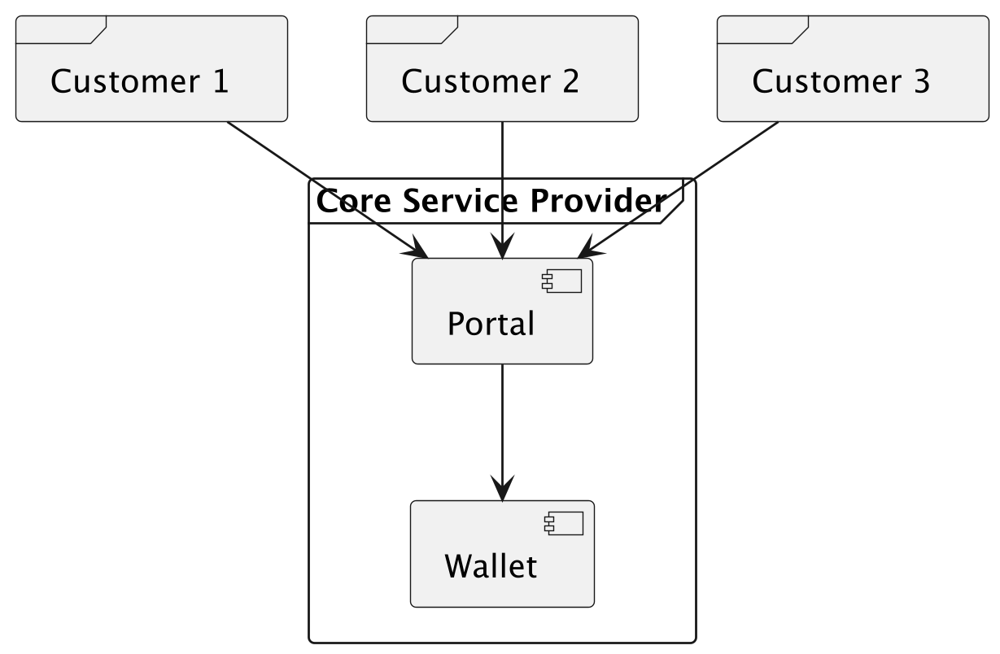

<details>
<summary>Plantuml code</summary>

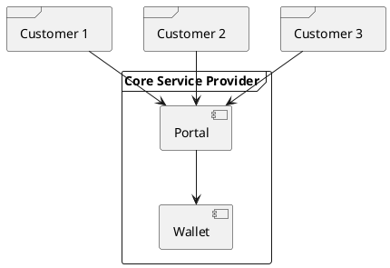
```plantuml
@startuml
frame "Core Service Provider" as csp {
    [Wallet] as miw
    [Portal] as p
}

frame "Customer 1" as c1
frame "Customer 2" as c2
frame "Customer 3" as c3

c1 --> p
c2 --> p
c3 --> p
p --> miw
@enduml
```

</details>

The pre-jupiter (i.e. pre R24.09) releases used a centralised multi-tenant wallet known as [Managed Identity Wallet](https://github.com/eclipse-tractusx/managed-identity-wallet) (MIW).
It was a Core Service B, so there was one instance hosted by the Core Service Provider (CSP) and used by all customers, who could access it through the Portal.

### Jupiter: Centralised use of a decentralised wallet

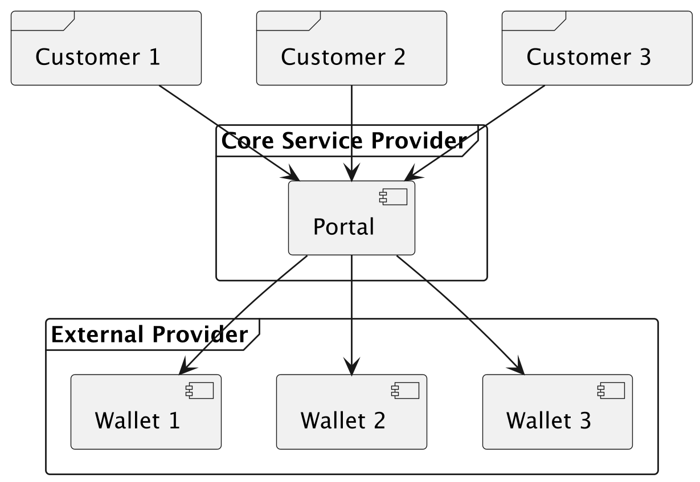

<details>
<summary>Plantuml code</summary>

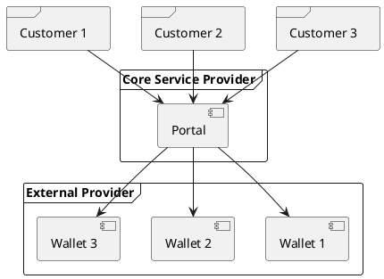
```plantuml
@startuml
frame "External Provider" as sap {
    [Wallet 1] as div1
    [Wallet 2] as div2
    [Wallet 3] as div3
}
frame "Core Service Provider" as csp {
    [Portal] as p
}

frame "Customer 1" as c1
frame "Customer 2" as c2
frame "Customer 3" as c3

c1 --> p
c2 --> p
c3 --> p

p --> div1
p --> div2
p --> div3
@enduml
```

</details>

With the Jupiter (R24.09) release, MIW was replaced by the proprietary wallet solution SAP DIV.
The Jupiter architecture differs mainly in two ways from its predecessor.
Wallet instances are no longer shared.
There is now one wallet instance per customer.
The wallet is no longer hosted by the CSP, but instead by an external provider.
However, the wallet is still a Core Service B and customers still access it via the Portal.

## Solutions for the Catena-X target wallet architecture

For the future of Catena-X's wallet architecture, we plan to introduce three solutions, all of which are designed to exist in parallel.
Solutions 1 and 2 are given priority.
Once both are implemented and stable, solution three can be added to the existing architecture.

### Solution 1: Wallets as a white-label service

Member companies will still be provided a wallet-as-a-service during onboarding, similar to the Jupiter architecture explained above.
However, the operating company will no longer be restricted to one wallet provider, but instead have the possibility to choose freely among **multiple** wallet providers (e.g. Cofinity-X may offer both SAP DIV and the [Identity Hub](https://github.com/eclipse-tractusx/tractusx-identityhub) as white label wallet solutions).

### Solution 2: Bring Your Own Wallet (BYOW)

New member companies may "bring their own wallet", meaning it is in their responsibility to obtain a Catena-X compliant wallet.
During onboarding they are required to provide the corresponding DID.
Member companies may choose to either host their wallet themselves or contract an external vendor.
This distinction is not visible to the Catena-X dataspace.

Bring Your Own Wallet enables member companies to use one wallet across multiple dataspaces, which is an essential step towards interoperability.
At the same time it covers both large corporations (who likely will want to host their wallet themselves) and SME's (who likely will want to contract an external vendor to set up their wallet for them).

### Solution 3: Choose wallet provider from marketplace

In this solution, new member companies will once again be provided a wallet during onboarding.
In contrast to solution 1 though, it is not a white label service.
Instead, new member companies will be presented with a list of accredited Enablement Service Providers (ESPs), which they can choose from.
The operator will then initiate communication between the new member company and the chosen ESP.
Once the ESP has set up the wallet for the new member company, it will provide the corresponding did to the operator.

This solution is similar to journey 1, both from a customer journey and a technical perspective.
In both solution 1 and 3, the new member company is being provided a wallet and in both solutions the Operating Company initiates the process.
Its main benefit lies in a smoother customer journey during onboarding.
As such, this solution is considered _nice-to-have_ until solutions 1 and 2 are fully implemented and stable.

## Wallet Assumptions

A wallet encompasses the management of

* private and public keys
* managing DID documents
* Verifiable Credentials (VCs)

and enables communication based on protocols like DCP.

The holder persona is in focus: no need for holder wallet to manage a revocation list.

## Credential Issuer Assumptions

* The issuer must be able to process credential requests, make credential offers, and issue credentials.
* The issuer must provide a metadata endpoint returning a list of credentials types and formats (see [DCP](https://eclipse-dataspace-dcp.github.io/decentralized-claims-protocol/v1.0-RC2/#issuermetadata) and [OpenID4VC](https://openid.net/specs/openid-4-verifiable-credential-issuance-1_0.html#name-credential-issuer-metadata) examples).
* The issuer must send VCs based on a selected protocol to the holder.

## Processes

### Current state

#### Successful Registration

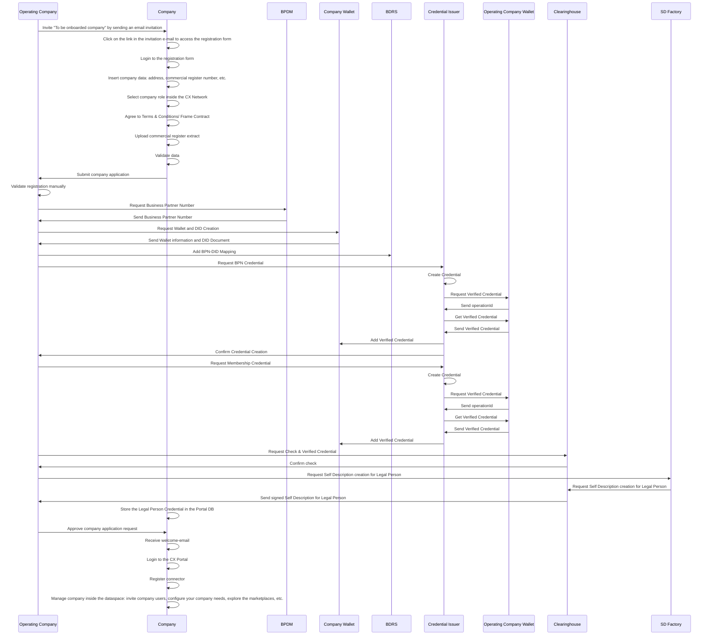
```mermaid
sequenceDiagram
    Operating Company->>Company: Invite "To be onboarded company" by sending an email invitation
    Company->>Company: Click on the link in the invitation e-mail to access the registration form
    Company->>Company: Login to the registration form
    Company->>Company: Insert company data: address, commercial register number, etc.
    Company->>Company: Select company role inside the CX Network
    Company->>Company: Agree to Terms & Conditions/ Frame Contract
    Company->>Company: Upload commercial register extract
    Company->>Company: Validate data
    Company->>Operating Company: Submit company application
    Operating Company->>Operating Company: Validate registration manually
    Operating Company->>BPDM: Request Business Partner Number
    BPDM->>Operating Company: Send Business Partner Number
    Operating Company->>Company Wallet: Request Wallet and DID Creation
    Company Wallet->>Operating Company: Send Wallet information and DID Document
    Operating Company->>BDRS: Add BPN-DID Mapping
    Operating Company->>Credential Issuer: Request BPN Credential
    Credential Issuer->>Credential Issuer: Create Credential
    Credential Issuer->>Operating Company Wallet: Request Verified Credential
    Operating Company Wallet->>Credential Issuer: Send operationId
    Credential Issuer->>Operating Company Wallet: Get Verified Credential
    Operating Company Wallet->>Credential Issuer: Send Verified Credential
    Credential Issuer->>Company Wallet: Add Verified Credential
    Credential Issuer->>Operating Company: Confirm Credential Creation
    Operating Company->>Credential Issuer: Request Membership Credential
    Credential Issuer->>Credential Issuer: Create Credential
    Credential Issuer->>Operating Company Wallet: Request Verified Credential
    Operating Company Wallet->>Credential Issuer: Send operationId
    Credential Issuer->>Operating Company Wallet: Get Verified Credential
    Operating Company Wallet->>Credential Issuer: Send Verified Credential
    Credential Issuer->>Company Wallet: Add Verified Credential
    Operating Company->>Clearinghouse: Request Check & Verified Credential
    Clearinghouse->>Operating Company: Confirm check
    Operating Company->>SD Factory: Request Self Description creation for Legal Person
    SD Factory->>Clearinghouse: Request Self Description creation for Legal Person
    Clearinghouse->>Operating Company: Send signed Self Description for Legal Person
    Company->>Company: Store the Legal Person Credential in the Portal DB
    Operating Company->>Company: Approve company application request
    Company->>Company: Receive welcome-email
    Company->>Company: Login to the CX Portal
    Company->>Company: Register connector
    Company->>Company: Manage company inside the dataspace: invite company users, configure your company needs, explore the marketplaces, etc.
```

Explanation of abbreviations:

* BDRS: BPN-DID Resolution Service
* SD Factory: Self-Description Factory

#### Use Case Participation

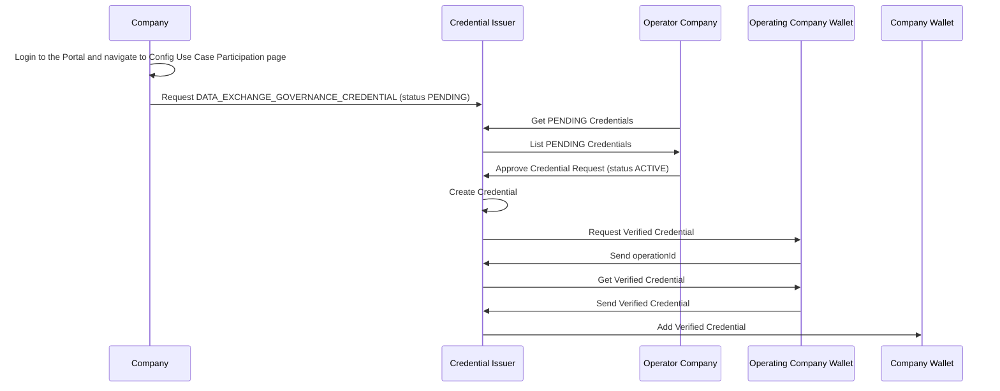
```mermaid
sequenceDiagram
    Company->>Company: Login to the Portal and navigate to Config Use Case Participation page
    Company->>Credential Issuer: Request DATA_EXCHANGE_GOVERNANCE_CREDENTIAL (status PENDING)
    Operator Company->>Credential Issuer: Get PENDING Credentials
    Credential Issuer->>Operator Company: List PENDING Credentials
    Operator Company->>Credential Issuer: Approve Credential Request (status ACTIVE)
    Credential Issuer->>Credential Issuer: Create Credential
    Credential Issuer->>Operating Company Wallet: Request Verified Credential
    Operating Company Wallet->>Credential Issuer: Send operationId
    Credential Issuer->>Operating Company Wallet: Get Verified Credential
    Operating Company Wallet->>Credential Issuer: Send Verified Credential
    Credential Issuer->>Company Wallet: Add Verified Credential
```

#### Credential Revocation

Only DATA_EXCHANGE_GOVERNANCE_CREDENTIAL can be revoked. BPN and Membership credentials are not enabled to be revoked.

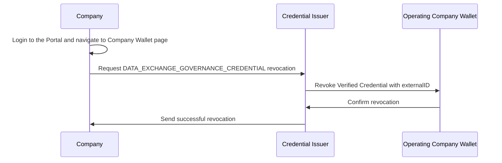
```mermaid
sequenceDiagram
    Company->>Company: Login to the Portal and navigate to Company Wallet page
    Company->>Credential Issuer: Request DATA_EXCHANGE_GOVERNANCE_CREDENTIAL revocation
    Credential Issuer->>Operating Company Wallet: Revoke Verified Credential with externalID
    Operating Company Wallet->>Credential Issuer: Confirm revocation
    Credential Issuer->>Company: Send successful revocation
```

#### Create Technical User for Connector Registration

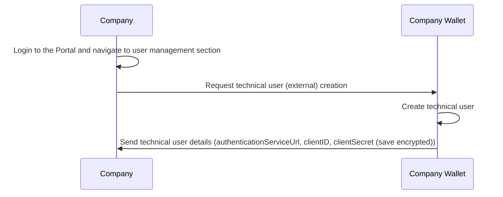
```mermaid
sequenceDiagram
    Company->>Company: Login to the Portal and navigate to user management section
    Company->>Company Wallet: Request technical user (external) creation
    Company Wallet->>Company Wallet: Create technical user
    Company Wallet->>Company: Send technical user details (authenticationServiceUrl, clientID, clientSecret (save encrypted))
```

#### Delete Technical User for Connector Registration

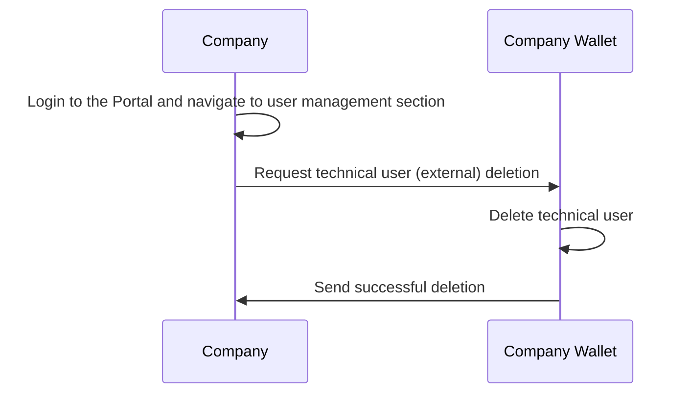
```mermaid
sequenceDiagram
    Company->>Company: Login to the Portal and navigate to user management section
    Company->>Company Wallet: Request technical user (external) deletion
    Company Wallet->>Company Wallet: Delete technical user
    Company Wallet->>Company: Send successful deletion
```

### Target state

#### Issuance

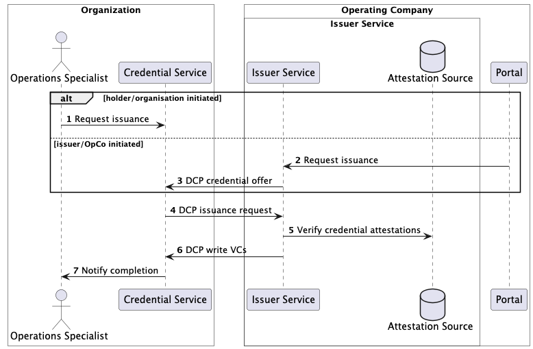

<details>
<summary>Plantuml code</summary>

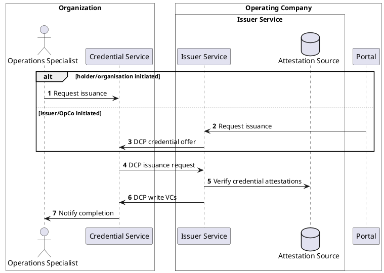
```plantuml
@startuml
!pragma teoz true
autonumber
box "Organization" #transparent
actor "Operations Specialist" as OS
participant "Credential Service" as CS
end box

box "Operating Company" #transparent
box "Issuer Service" #transparent
participant "Issuer Service" as IS
database "Attestation Source" as AS
end box
participant "Portal" as P
end box

alt holder/organisation initiated
OS -> CS: Request issuance
else issuer/OpCo initiated
P -> IS: Request issuance
IS -> CS: DCP credential offer
end

CS -> IS: DCP issuance request
IS -> AS: Verify credential attestations
IS -> CS: DCP write VCs
OS <- CS: Notify completion
@enduml
```

</details>

The Attestation Source is a logical component inside the issuer service.
For every onboarded member, it stores a list of attributes.
When issuance of a VC is requested, the Issuer Service checks the member’s entry in the Attestation Source.
If all required attributes for the requested VC are present, the Issuer Service proceeds with issuing the credential.

#### Re-issuance


<details>
<summary>Plantuml code</summary>

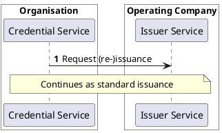
```plantuml
@startuml
autonumber
box "Organisation" #transparent
participant "Credential Service" as CS
end box
box "Operating Company" #transparent
participant "Issuer Service" as IS
end box
CS -> IS: Request (re-)issuance
note over CS,IS: Continues as standard issuance
@enduml
```

</details>

* reissuance is not a separate flow
* request 1 in this diagram is equivalent to request 1 in the issuance diagram above

#### Onboarding

Onboarding has been separated into two parts, as of now called _initial onboarding_ and _infrastructure setup_.
The purpose of this separation is to distinguish between those parts of onboarding which directly touch on the wallet architecture _(infrastructure setup)_ and those parts which do not _(initial onboarding)._

##### Initial onboarding

Initial onboarding concerns those parts of onboarding _which do **not** touch on the wallet architecture._
These are the initial stages where the new company communicates with the operating company's sales team and provides essential information about itself.
How this is done is not relevant for the wallet architecture and is within the scope of the onboarding/offboarding expert group.

We make the assumption that at the end of this flow, the organization has

* chosen between hosted or self-hosted architecture
* if self-hosted: appointed an operations specialist
* received a BPN from the operating company

A high-level sequence of this flow is shown below for completeness' sake.

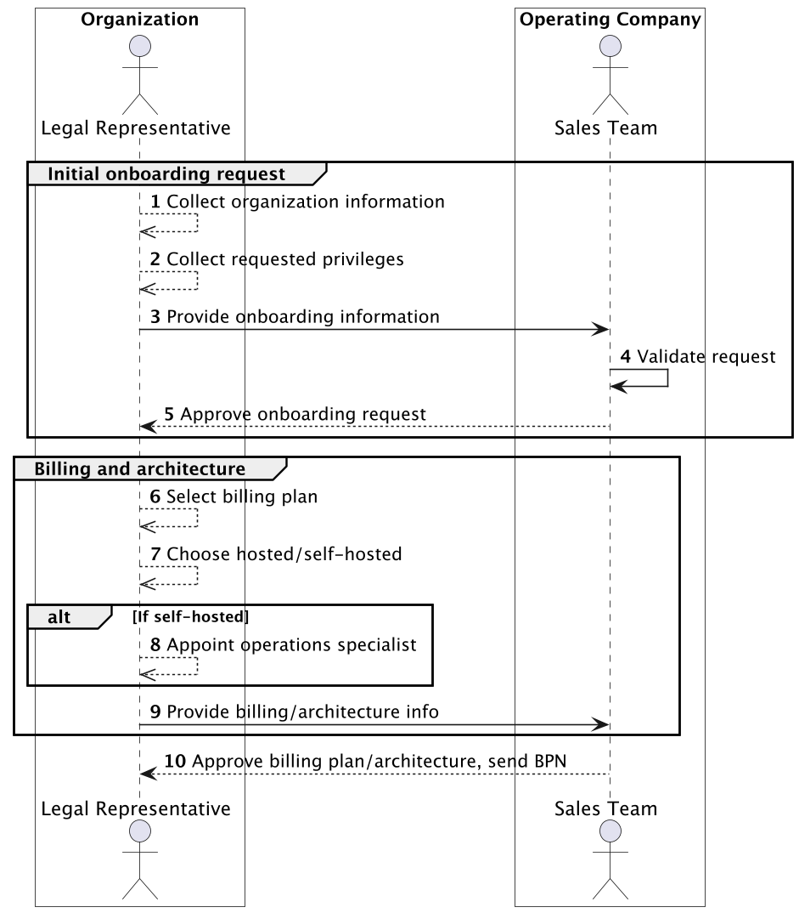

<details>
<summary>Plantuml code</summary>

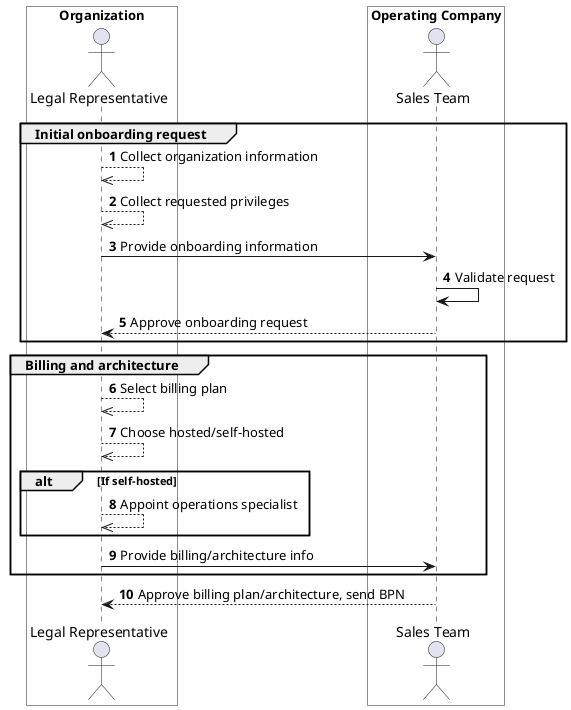
```plantuml
@startuml
autonumber
box "Organization" #transparent
actor "Legal Representative" as LR
end box

box "Operating Company" #transparent
actor "Sales Team" as ST
end box

group Initial onboarding request
LR -->> LR: Collect organization information
LR -->> LR: Collect requested privileges
LR -> ST: Provide onboarding information
ST -> ST: Validate request
LR <-- ST: Approve onboarding request
end group

group Billing and architecture
LR -->> LR: Select billing plan
LR -->> LR: Choose hosted/self-hosted
alt If self-hosted
LR -->> LR: Appoint operations specialist
end alt
LR -> ST: Provide billing/architecture info
end group
ST --> LR: Approve billing plan/architecture, send BPN
@enduml
```

</details>

##### Infrastructure setup

This flow starts after the _Initial onboarding_ flow is completed.
At the beginning of the flow, the organization must have:

* chosen between hosted or self-hosted architecture
* if self-hosted: appointed an operations specialist
* received a BPN from the operating company

There are two versions of this flow: _hosted by member_ and _hosted for member._
For the _hosted by member_ flow, the organization hosts its own credential service.
For the _hosted_ flow, a third-party provider hosts the credential service.
This third-party provider may be:

* an Enablement Service Provider
* a white label service through the Operating Company, or
* the Operating Company acting as an Enablement Service Provider

These three cases will need to be treated separately in the initial onboarding, but can all be captured by one flow in the infrastructure setup phase.

###### Hosted by member

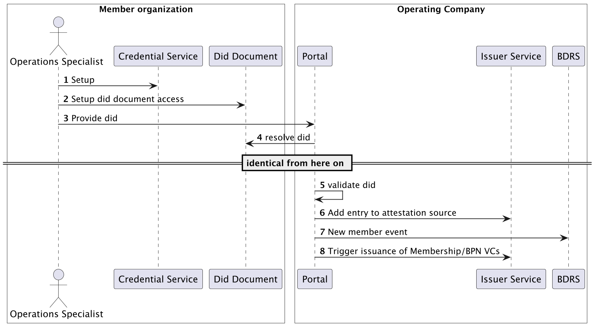

<details>
<summary>Plantuml code</summary>

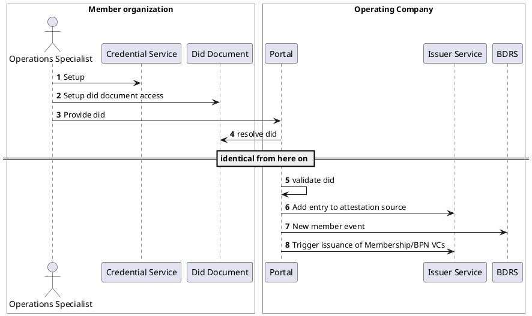
```plantuml
@startuml
!pragma teoz true
autonumber
box "Member organization" #transparent
    actor "Operations Specialist" as OS
    participant "Credential Service" as CS
    participant "Did Document" as DD
end box
box "Operating Company" #transparent
    participant "Portal" as P
    participant "Issuer Service" as IS
    participant BDRS
end box

OS -> CS: Setup
OS -> DD: Setup did document access
OS -> P: Provide did
P -> DD: resolve did
== identical from here on ==
P -> P: validate did
P -> IS: Add entry to attestation source
P -> BDRS: New member event
P -> IS: Trigger issuance of Membership/BPN VCs
@enduml
```

</details>

* step _2 Setup did_ document access likely comes with considerable administrative effort for the organization

###### Hosted for member

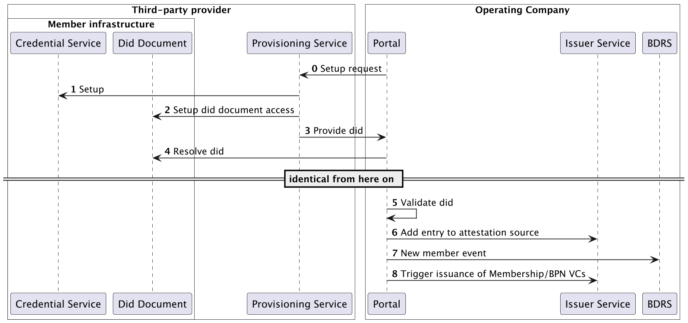

<details>
<summary>Plantuml code</summary>

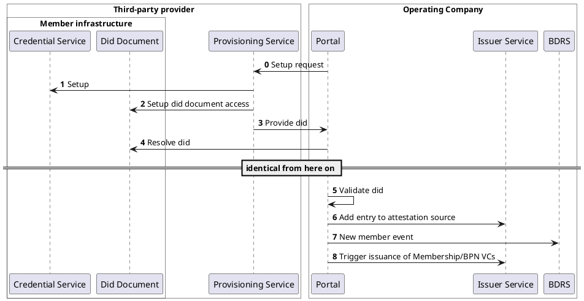
```plantuml
@startuml
!pragma teoz true
autonumber 0
box "Third-party provider" #transparent
    box "Member infrastructure" #transparent
        participant "Credential Service" as CS
        participant "Did Document" as DID
    end box
    participant "Provisioning Service" as PS
end box
box "Operating Company" #transparent
    participant "Portal" as P
    participant "Issuer Service" as IS
    participant "BDRS" as BDRS
end box

P -> PS: Setup request
PS -> CS: Setup
PS -> DID: Setup did document access
PS -> P: Provide did
P -> DID: Resolve did
== identical from here on ==
P -> P: Validate did
P -> IS: Add entry to attestation source
P -> BDRS: New member event
P -> IS: Trigger issuance of Membership/BPN VCs
@enduml
```

</details>

The provisioning service provides an interface between the operating company and the third-party provider, allowing it to initiate the setup of the member infrastructure.
It will not be standardised for solutions 1 and 2.
In the future, we aim for high-level standardisation with solution 3.

#### Offboarding

An offboarded company is indicated by a special “offboarded” attribute.
During the offboarding process, the portal will add this attribute and then revoke all active VCs the now offboarded company holds.
This attribute will cause any and all issuance requests to fail.

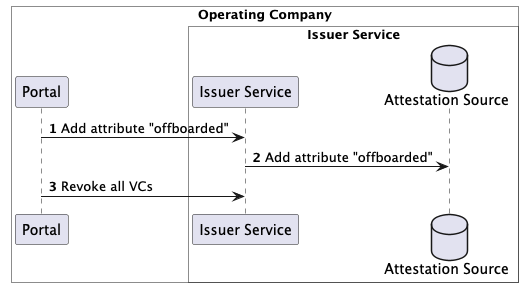

<details>
<summary>Plantuml code</summary>

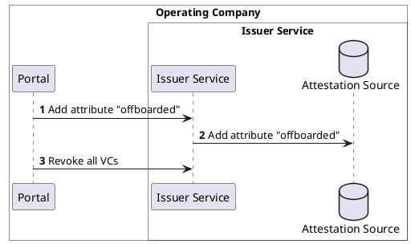
```plantuml
@startuml
!pragma teoz true
autonumber
box "Operating Company" #transparent
participant Portal as P
box "Issuer Service" #transparent
participant "Issuer Service" as IS
database "Attestation Source" as AS
end box
end box

P -> IS: Add attribute "offboarded"
IS -> AS: Add attribute "offboarded"
P -> IS: Revoke all VCs
@enduml
```

</details>

#### Issuer key rotation

The new public key must be added to the did document before rotating the private key.
Otherwise, verification of a VC signed with the new key pair may fail if the corresponding public key is not yet present in the issuer’s did document.

After key rotation, VCs signed with the previous key pair may still be active.
Therefore, the previous public key is kept in the did document until all VCs signed with the old key pair are expired.
I.e. there may be multiple public keys in the did document at the same time.

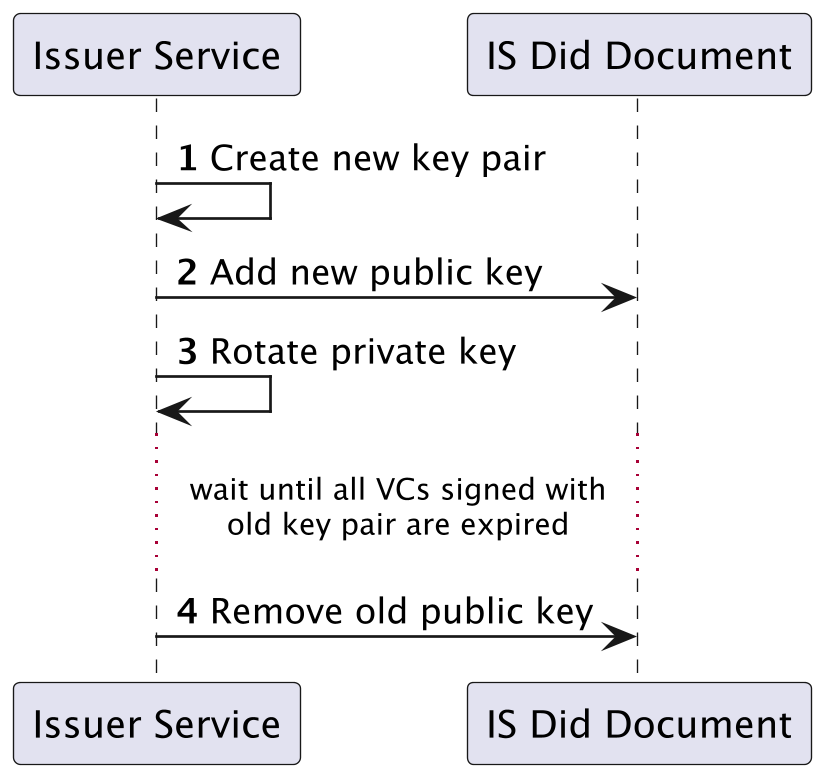

<details>
<summary>Plantuml code</summary>

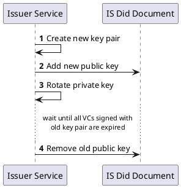
```plantuml
@startuml
autonumber
participant "Issuer Service" as IS
participant "IS Did Document" as DID
IS -> IS: Create new key pair
IS -> DID: Add new public key
IS -> IS: Rotate private key
...wait until all VCs signed with\nold key pair are expired...
IS -> DID: Remove old public key
@enduml
```

</details>

#### Security breaches

##### Compromised issuer key

> Definition: A third party has gained unauthorized access to a private key.

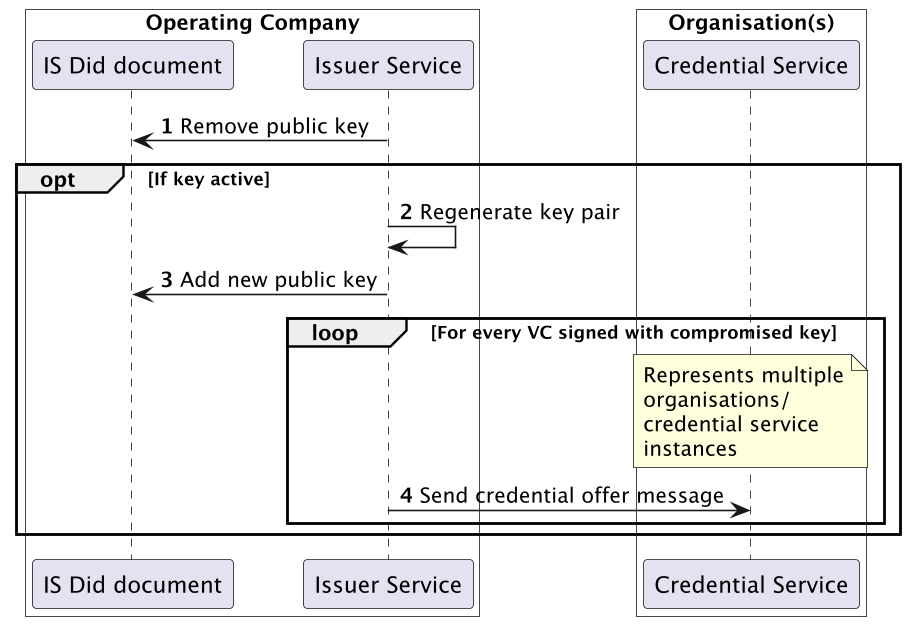

<details>
<summary>Plantuml code</summary>

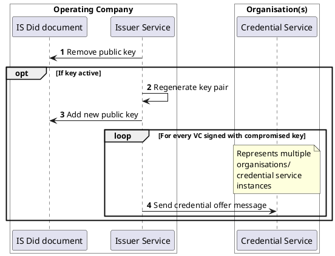
```plantuml
@startuml
autonumber
box "Operating Company" #transparent
participant "IS Did document" as DD
participant "Issuer Service" as IS
end box
box "Organisation(s)" #transparent
participant "Credential Service" as CS
end box

IS -> DD: Remove public key
opt If key active
IS -> IS: Regenerate key pair
IS -> DD: Add new public key
loop For every VC signed with compromised key
note over CS
Represents multiple
organisations/
credential service
instances
end note
IS -> CS: Send credential offer message
end
end
@enduml
```

</details>

##### Compromised issuer did

tbd

#### Successful registration

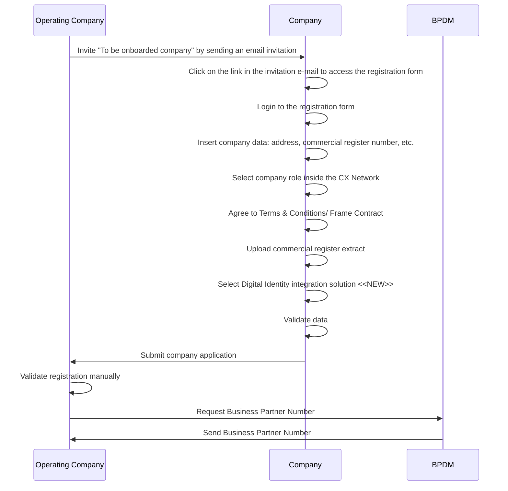
```mermaid
sequenceDiagram
    Operating Company->>Company: Invite "To be onboarded company" by sending an email invitation
    Company->>Company: Click on the link in the invitation e-mail to access the registration form
    Company->>Company: Login to the registration form
    Company->>Company: Insert company data: address, commercial register number, etc.
    Company->>Company: Select company role inside the CX Network
    Company->>Company: Agree to Terms & Conditions/ Frame Contract
    Company->>Company: Upload commercial register extract
    Company->>Company: Select Digital Identity integration solution <<NEW>>
    Company->>Company: Validate data
    Company->>Operating Company: Submit company application
    Operating Company->>Operating Company: Validate registration manually
    Operating Company->>BPDM: Request Business Partner Number
    BPDM->>Operating Company: Send Business Partner Number
```

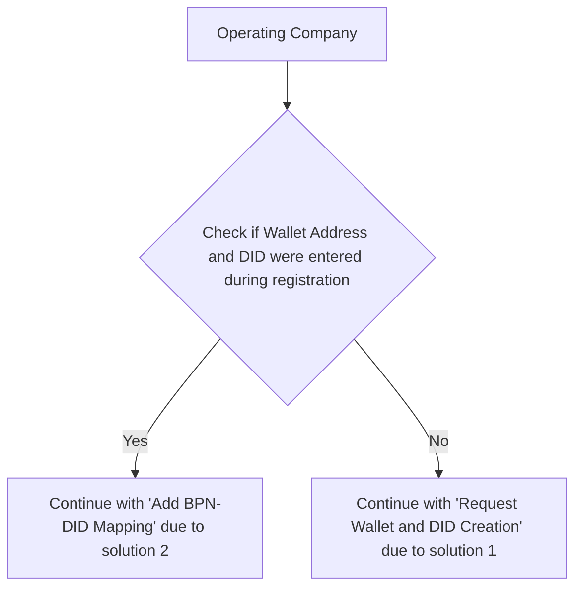
```mermaid
graph TD
    A[Operating Company] --> B{Check if Wallet Address and DID were entered during registration}
    B -->|Yes| C[Continue with 'Add BPN-DID Mapping' due to solution 2]
    B -->|No| D[Continue with 'Request Wallet and DID Creation' due to solution 1]
```

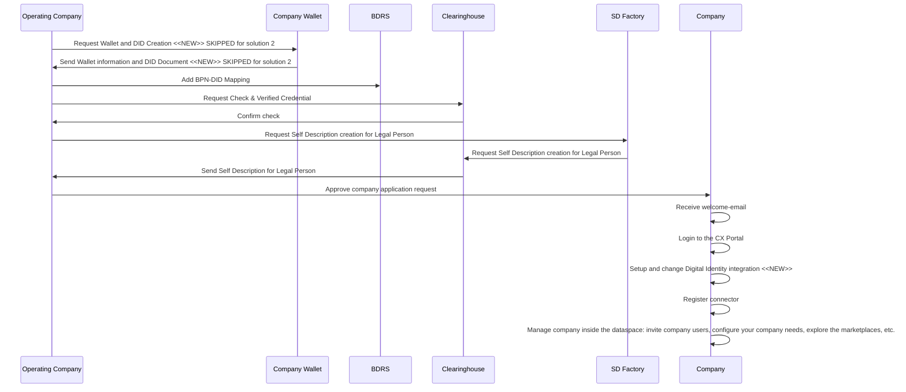
```mermaid
sequenceDiagram
    Operating Company->>Company Wallet: Request Wallet and DID Creation <<NEW>> SKIPPED for solution 2
    Company Wallet->>Operating Company: Send Wallet information and DID Document <<NEW>> SKIPPED for solution 2
    Operating Company->>BDRS: Add BPN-DID Mapping
    Operating Company->>Clearinghouse: Request Check & Verified Credential
    Clearinghouse->>Operating Company: Confirm check
    Operating Company->>SD Factory: Request Self Description creation for Legal Person
    SD Factory->>Clearinghouse: Request Self Description creation for Legal Person
    Clearinghouse->>Operating Company: Send Self Description for Legal Person
    Operating Company->>Company: Approve company application request
    Company->>Company: Receive welcome-email
    Company->>Company: Login to the CX Portal
    Company->>Company: Setup and change Digital Identity integration <<NEW>>
    Company->>Company: Register connector
    Company->>Company: Manage company inside the dataspace: invite company users, configure your company needs, explore the marketplaces, etc.
```

##### Changed/Added

* Added `Select Digital Identity integration solution` in registration form: up to now digital identity isn't part of the registration form

[Solution 1](#solution-1-wallets-as-a-white-label-service) should the default solution set in the registration process

* Added check for [solution 2](#solution-2-bring-your-own-wallet-byow) or [solution 1](#solution-1-wallets-as-a-white-label-service) during registration approval process

* Added `Setup and change Digital Identity integration` in the Portal (technical integration) once a company has been onboarded to the network

* Removed Credential Request and Creation flow during registration approval: should be moved to process triggered from company wallet

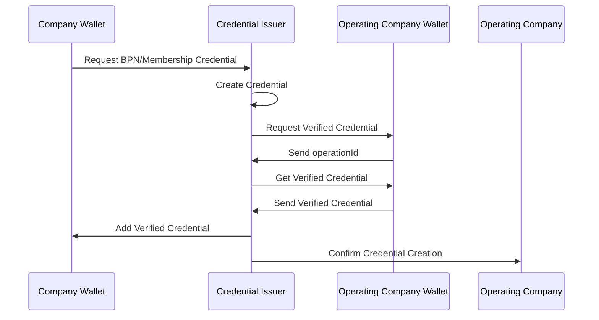
```mermaid
sequenceDiagram
    Company Wallet->>Credential Issuer: Request BPN/Membership Credential
    Credential Issuer->>Credential Issuer: Create Credential
    Credential Issuer->>Operating Company Wallet: Request Verified Credential
    Operating Company Wallet->>Credential Issuer: Send operationId
    Credential Issuer->>Operating Company Wallet: Get Verified Credential
    Operating Company Wallet->>Credential Issuer: Send Verified Credential
    Credential Issuer->>Company Wallet: Add Verified Credential
    Credential Issuer->>Operating Company: Confirm Credential Creation
```

#### Credential Revocation

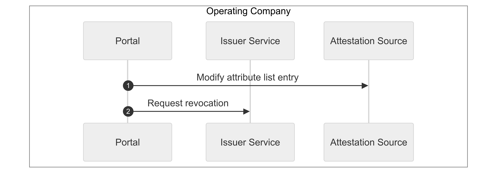

<details>
<summary>Plantuml code</summary>

```plantuml
```

</details>

Modifying the attribute list is a mandatory step in the flow, as otherwise there cannot be a valid reason for credential revocation.

#### Create Technical User for Connector Registration

Not needed anymore in case of [solution 2](#solution-2-bring-your-own-wallet-byow).

For [solution 1](#solution-1-wallets-as-a-white-label-service), the option to create a technical user for connector registration via the new Provisioning Service needs to be enabled.

#### Delete Technical User for Connector Registration

Not needed anymore in case of [solution 2](#solution-2-bring-your-own-wallet-byow).

For [solution 1](#solution-1-wallets-as-a-white-label-service), the option to delete a technical user for connector registration via the new Provisioning Service needs to be enabled.

## Questions

### What information does a new member company need to provide for BYOW?

A new member company only needs to provide the DID to its Catena-X compliant wallet.
Catena-X compliance for wallets will be defined in CX-0013 and CX-0049 with R25.09.
It will, among other things, require the did documents to contain the wallet endpoint.

### How can did web be made more secure?

To enhance the security of DID:web, hash lists can be implemented as a method for ensuring data integrity.
By storing hashes of each DID document, any alteration becomes detectable through hash mismatches, signaling potential tampering.

### Should a scenario where a company has its own wallet but not its own DID be supported?

No, if you bring your own wallet you must also bring your own DID.

### Proof of possession in the case of BYOW?

In general there is no need to provide proof of possession here. The issuer is binding the credentials to the DID provided by the company wallet. As long as the company (wallet) keeps control of the corresponding private key material only the company can generate a valid verifiable presentation with proper authentication proof.
If the issuer wants to make sure that the company cannot pass its identity (DID) to another party, proof of possession is not enough. In this case the wallet has to proof that even the holder cannot retrieve and transfer the key (see key attestation). But this is not required here.

### What about service accounts (technical users for connector registration)?

Currently, this technical user is used to create an ID token, which can be used later to retrieve a verifiable presentation.
There are multiple ways to design this system. One option would be to run the EDC and the Security Token Service (STS) together, so there would be no technical user needed because the STS would have access to a private key that can be used to sign an ID token. In this case, no technical user would be needed. If the STS is not part of the EDC but a component of the wallet, a technical user must be available to access the wallet. In this case, the technical user should have restricted authorizations, limited to only signing ID tokens.

Please also refer to [processes](#processes) for current and to be handling of technical users.

### Can a member company move from one holder wallet to another?

This should pose no problem, except when changing the DID.

### What happens with existing EDC contracts when the DID is changed?

No implications. The move of the DID from one wallet to another one should only be seen as a key revocation.

## Useful links

* Related concept: [Moving to DID-based Identifiers in the Catena-X Protocol Layer](https://github.com/catenax-eV/cx-ex-dataspace-connectivity/blob/main/docs/bpn-did-resolution/moving-to-DID-identifiers.md#moving-to-did-based-identifiers-in-the-catena-x-protocol-layer)
* Related issue: Deprecation StatusList2021, BitStringStatusList current W3C standard
